# 📦 LogiTrack IQ

**Torre de control de inventario** — extensión de [LogiTrack API](https://github.com/jorgegmch/logitrack-api)
con detección automática de riesgo de stock, propuesta de compra vía
IA/MCP, dashboard de gestión y flujo diario automatizado con n8n.

---

## 📋 Tabla de contenidos

- [Descripción general](#-descripción-general)
- [Arquitectura](#️-arquitectura)
- [Funcionalidades principales](#-funcionalidades-principales)
- [Stack tecnológico](#️-stack-tecnológico)
- [Estructura del proyecto](#-estructura-del-proyecto)
- [Instalación y ejecución](#-instalación-y-ejecución)
- [Usuarios de prueba](#-usuarios-de-prueba)
- [Rutas principales](#-rutas-principales)
- [Seguridad](#-seguridad)
- [Evidencia del proceso (SDD/TDD)](#-evidencia-del-proceso-sddtdd)
- [Servidor MCP — evidencia de herramientas](#-servidor-mcp--evidencia-de-herramientas)
- [Evidencia de endpoints protegidos](#-evidencia-de-endpoints-protegidos-swagger)
- [Docker](#-docker)
- [Video de sustentación](#-video-de-sustentación)

---

## 🧠 Descripción general

LogiTrack S.A. ya contaba con un backend (LogiTrack API) para gestionar
bodegas, productos y movimientos de inventario, pero la revisión de
stock era manual. **LogiTrack IQ** extiende ese backend para construir
una torre de control que:

1. Calcula el stock real a partir de los movimientos registrados.
2. Detecta productos por debajo de su punto de reorden.
3. Permite que un flujo automatizado (**n8n + MCP + IA**) proponga una
   orden de compra en estado `BORRADOR`.
4. Permite a un administrador **aprobar** y **recibir** esa orden,
   actualizando el inventario automáticamente.
5. Muestra el resultado en un **dashboard** con indicadores, alertas y
   acciones.

---

## 🏗️ Arquitectura

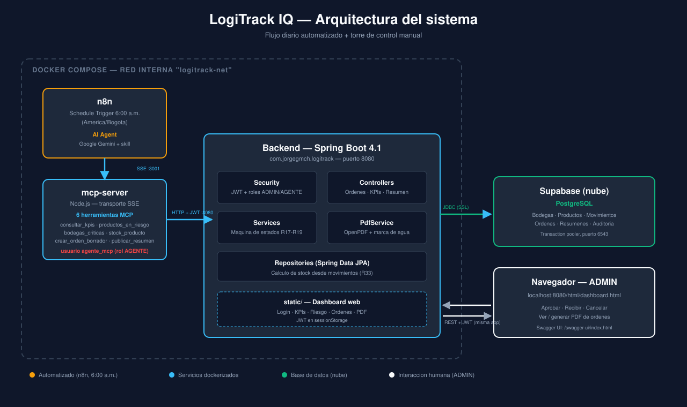

El flujo diario corre solo, sin intervención humana, hasta el punto de
crear una orden en borrador:

```
n8n (6:00 a.m. America/Bogota)
  └─ AI Agent (Google Gemini) + skill operativa
      └─ MCP Client Tool → mcp-server (6 herramientas, usuario AGENTE)
          └─ API REST (Spring Boot) → PostgreSQL (Supabase)
```

El administrador interviene manualmente desde el dashboard web
(servido por el propio backend) para aprobar, recibir o cancelar las
órdenes generadas.

---

## ✨ Funcionalidades principales

- **Cálculo de stock real** desde movimientos (`ENTRADA`, `SALIDA`,
  `TRANSFERENCIA`), nunca desde un campo cacheado.
- **Detección de riesgo** por producto (consumo diario promedio,
  punto de reorden, días de cobertura) y de bodegas críticas
  (ocupación ≥ 90%).
- **Máquina de estados de órdenes**: `BORRADOR → APROBADA → RECIBIDA`
  o `CANCELADA`, con recepción transaccional (genera automáticamente
  un movimiento `ENTRADA`).
- **PDF de la orden** con marca de agua diagonal `BORRADOR` cuando
  corresponde, diseño con tabla de detalle y totales.
- **Servidor MCP** con exactamente 6 herramientas, sin capacidad de
  aprobar/cancelar/recibir órdenes (restricción de diseño obligatoria).
- **Flujo n8n** con AI Agent que consulta riesgo, crea como máximo una
  orden por ejecución, y publica un resumen diario del panel.
- **Dashboard web** integrado al sistema base existente: KPIs, riesgo,
  órdenes en borrador, histórico de órdenes, generación/visualización
  de PDF, y las acciones de aprobar/recibir/cancelar (solo ADMIN).
- **Dockerizado**: backend, servidor MCP y n8n levantan con un solo
  comando, comunicándose por nombre de servicio en la misma red.

---

## 🛠️ Stack tecnológico

| Capa | Tecnología |
|---|---|
| Backend | Java 17, Spring Boot 4.1.0, Spring Security 7, Maven |
| Base de datos | PostgreSQL (Supabase, transaction pooler) |
| PDF | OpenPDF 1.3.32 |
| Servidor MCP | Node.js 20, `@modelcontextprotocol/sdk` 1.30.0, Express, SSE |
| Automatización | n8n (AI Agent + Google Gemini) |
| Frontend | HTML/CSS/JS sin framework, Chart.js |
| Contenedores | Docker, Docker Compose |
| Documentación API | Swagger / OpenAPI (springdoc) |

---

## 📁 Estructura del proyecto

```
logitrack-iq/
├── Dockerfile                  # Backend (build multi-stage Maven → JRE)
├── docker-compose.yml          # backend + mcp-server + n8n
├── database/                   # schema.sql, data.sql
├── docs/
│   ├── capturas/                # Evidencia visual (MCP, Swagger)
│   ├── sdd/                     # Documentos SDD + evidencia TDD
│   └── diagrama-arquitectura.svg
├── mcp-server/
│   ├── Dockerfile
│   ├── src/index.js             # Las 6 herramientas MCP
│   └── evidencia-mcp.md
├── n8n/
│   └── resumen-diario-inventario.json
├── skills/
│   └── operacion-logitrack/SKILL.md
├── src/main/java/com/jorgegmch/logitrack/
│   ├── config/  controller/  dto/  entity/  exception/
│   ├── listener/  repository/  security/  service/
│   └── LogitrackApplication.java
├── src/main/resources/
│   ├── static/                  # Frontend (login, dashboard, torre de control)
│   └── application.properties.example
└── src/test/                    # Tests unitarios e integración
```

> **Nota sobre el frontend:** en vez de crear una carpeta `frontend/`
> nueva y separada, la "Torre de control — LogiTrack IQ" se integró
> dentro del `dashboard.html` ya existente del sistema base, con un
> único login y un único `api.js` compartidos (migrado de
> `localStorage` a `sessionStorage`, como exige la especificación).
> Decisión documentada en `docs/sdd/04-tareas.md`.

---

## 🚀 Instalación y ejecución

Ambas rutas requieren primero:

```bash
git clone https://github.com/jorgegmch/logitrack-iq.git
cd logitrack-iq
```

Y recrear dos archivos de configuración que **no viajan en el repo**
(contienen credenciales):

```bash
cp src/main/resources/application.properties.example src/main/resources/application.properties
cp mcp-server/env.example mcp-server/.env
```

Completa ahí las credenciales reales de Supabase, el secreto JWT, y el
usuario/contraseña de `agente_mcp`.

### Opción A — Docker (recomendada)

```bash
docker compose up --build
```

Levanta los 3 servicios en la misma red interna (`logitrack-net`):
backend en `:8080`, mcp-server en `:3001`, n8n en `:5679`.

> **Importante:** el workflow exportado (`n8n/resumen-diario-inventario.json`)
> trae por defecto el endpoint `http://host.docker.internal:3001/sse`
> en el nodo *MCP Client Tool*, pensado para ejecución manual/mixta.
> **Si ejecutas todo vía Docker Compose**, abre ese nodo después de
> importar el workflow y cambia el endpoint a:
> ```
> http://mcp-server:3001/sse
> ```
> (nombre de servicio dentro de la red de Docker — más robusto que
> `host.docker.internal`, que solo funciona con Docker Desktop).

### Opción B — Ejecución manual

```bash
# Terminal 1 — Backend
./mvnw spring-boot:run

# Terminal 2 — Servidor MCP
cd mcp-server
npm install
npm start

# Terminal 3 — n8n (contenedor suelto)
docker run -d --name n8n_logitrack -p 5679:5678 n8nio/n8n
```

En este modo, el endpoint del nodo *MCP Client Tool* en n8n debe ser
`http://host.docker.internal:3001/sse` (valor por defecto del JSON
exportado).

### En cualquiera de las dos rutas, para probar el flujo de n8n

1. Abre `http://localhost:5679`, crea el usuario owner si es la
   primera vez.
2. Importa `n8n/resumen-diario-inventario.json`.
3. Abre el nodo **Google Gemini Chat Model** → crea/selecciona tu
   credencial con una API key de [Google AI Studio](https://aistudio.google.com/apikey)
   (nivel gratuito, no requiere tarjeta).
4. Confirma/ajusta el endpoint del nodo **MCP Client Tool** según la
   ruta elegida (ver nota arriba).
5. **Execute workflow**.

---

## 👤 Usuarios de prueba

| Usuario | Contraseña | Rol | Uso |
|---|---|---|---|
| `admin` | `Admin123!` | `ADMIN` | Acceso completo: aprobar, recibir, cancelar órdenes, gestión de usuarios |
| `empleado` | `Empleado123!` | `EMPLEADO` | Registro manual de movimientos |
| `agente_mcp` | `Agente123!` | `AGENTE` | Usuario técnico del servidor MCP — consulta y crea órdenes en borrador, nunca aprueba |

---

## 🔗 Rutas principales

| Recurso | URL |
|---|---|
| Login (sistema completo) | `http://localhost:8080/html/login.html` |
| Dashboard + Torre de control | `http://localhost:8080/html/dashboard.html` |
| Swagger / OpenAPI | `http://localhost:8080/swagger-ui/index.html` |
| Editor de n8n | `http://localhost:5679` |
| Endpoint SSE del servidor MCP | `http://localhost:3001/sse` |

Endpoints clave de la API (ver Swagger para el listado completo):

| Método | Ruta | Descripción |
|---|---|---|
| `POST` | `/auth/login` | Autenticación, devuelve JWT |
| `GET` | `/kpis` | Los 4 indicadores + movimientos de ayer |
| `GET` | `/productos/riesgo` | Productos por debajo del punto de reorden |
| `GET` | `/bodegas/criticas` | Bodegas con ocupación ≥ 90% |
| `POST` | `/ordenes` | Crea una orden en `BORRADOR` |
| `PATCH` | `/ordenes/{id}/estado` | Aprobar / recibir / cancelar (solo ADMIN) |
| `POST` / `GET` | `/ordenes/{id}/pdf` | Generar / visualizar el PDF de la orden |
| `POST` / `GET` | `/panel/resumen` | Publicar / consultar el resumen diario |

---

## 🔐 Seguridad

- Autenticación JWT, reutilizada del proyecto base.
- Roles: `ADMIN`, `EMPLEADO`, `AGENTE` (nuevo, para el servidor MCP).
- El servidor MCP **no tiene ninguna herramienta para aprobar, cancelar
  o recibir órdenes** — restricción de diseño obligatoria (R32).
- El JWT del dashboard se guarda únicamente en `sessionStorage`
  (nunca `localStorage`), según la especificación.

---

## 🧪 Evidencia del proceso (SDD/TDD)

Documentación completa del proceso de diseño y desarrollo dirigido por
pruebas:

- [`docs/sdd/01-propuesta.md`](docs/sdd/01-propuesta.md)
- [`docs/sdd/02-especificacion.md`](docs/sdd/02-especificacion.md)
- [`docs/sdd/03-diseno.md`](docs/sdd/03-diseno.md)
- [`docs/sdd/04-tareas.md`](docs/sdd/04-tareas.md)
- [`docs/sdd/evidencia-sdd.md`](docs/sdd/evidencia-sdd.md) — trazabilidad
  regla→prueba, hashes de commits obligatorios, y ciclos rojo→verde.

---

## 🤖 Servidor MCP — evidencia de herramientas

Las 6 herramientas exactas, probadas contra el backend real (ver
detalle completo en [`mcp-server/evidencia-mcp.md`](mcp-server/evidencia-mcp.md)):

| `consultar_kpis` | `consultar_bodegas_criticas` |
|---|---|
| 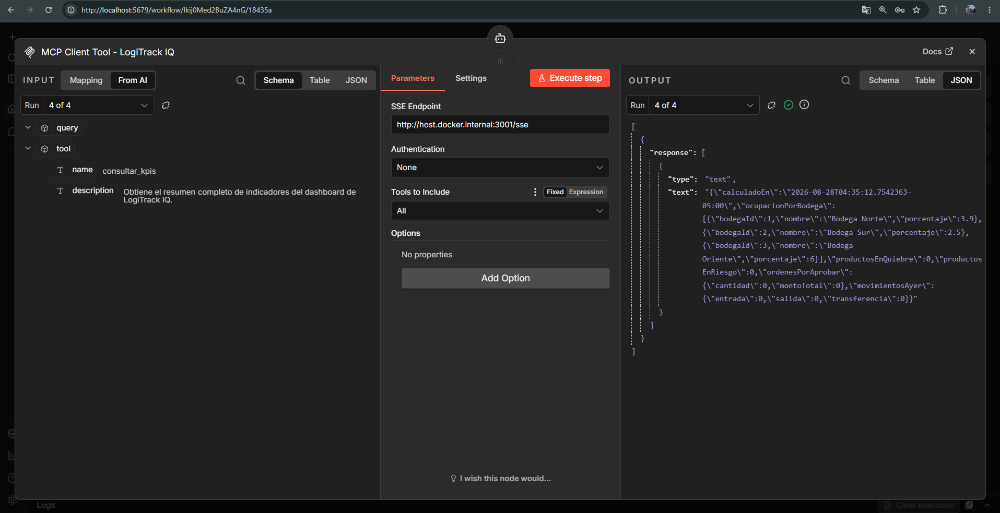 | 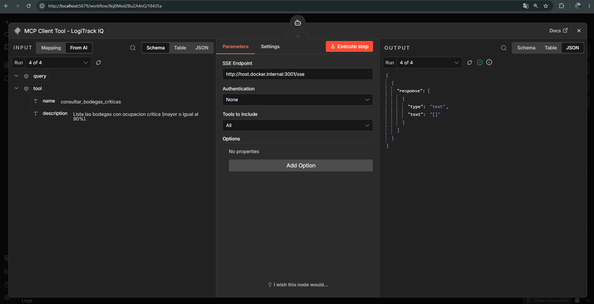 |

| `consultar_productos_en_riesgo` | Ejecución completa — canvas exitoso |
|---|---|
| 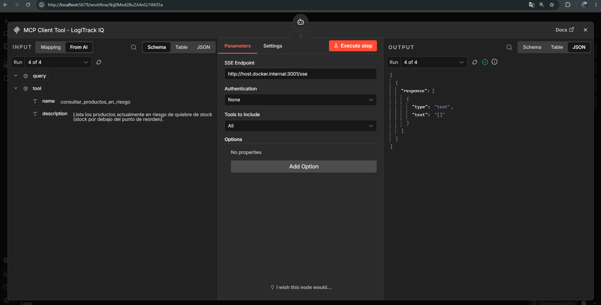 | 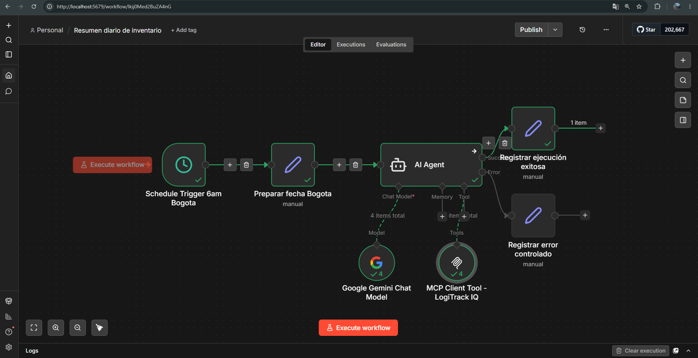 |

| `publicar_resumen` (dentro del flujo) | Salida del AI Agent |
|---|---|
| 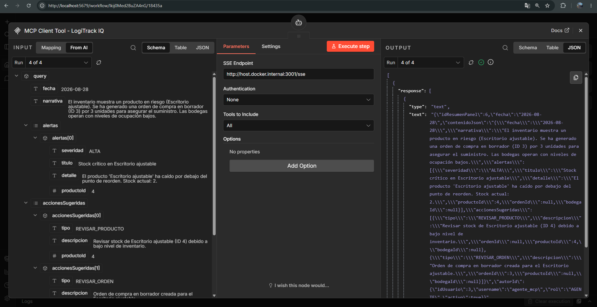 | 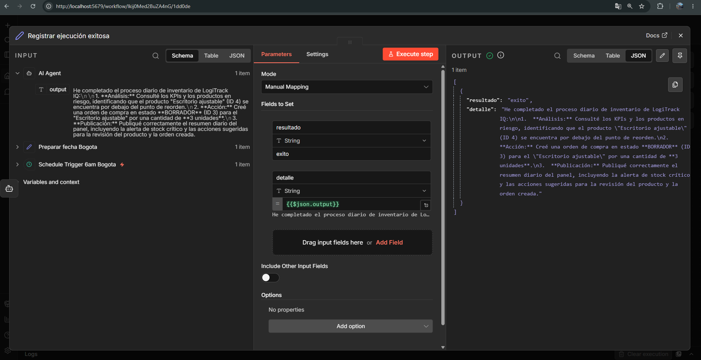 |

---

## 🔒 Evidencia de endpoints protegidos (Swagger)

Secuencia completa: acceso denegado sin token → login real → JWT
autorizado → acceso permitido → acceso denegado por rol incorrecto.

| 1. Sin token | 2. Login admin |
|---|---|
| 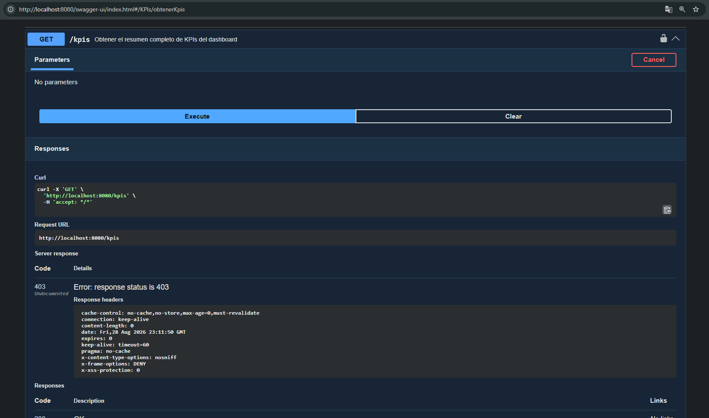 | 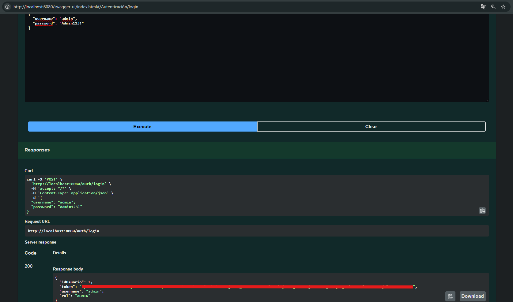 |

| 3. Authorize | 4. Con token (200) |
|---|---|
| 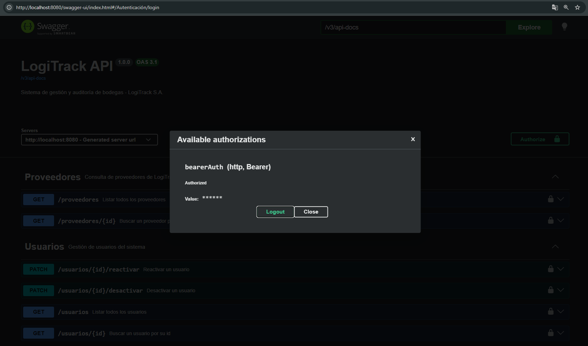 | 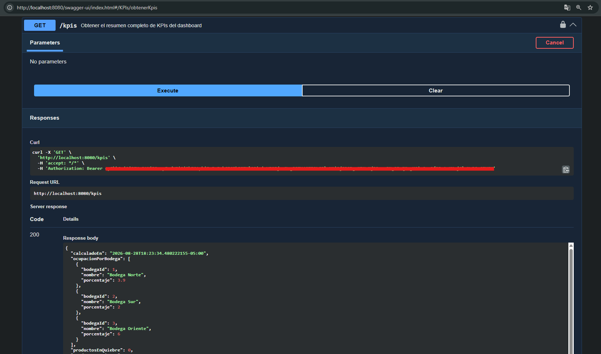 |

| 5. Login agente | 6. Rol incorrecto (403) |
|---|---|
|  | 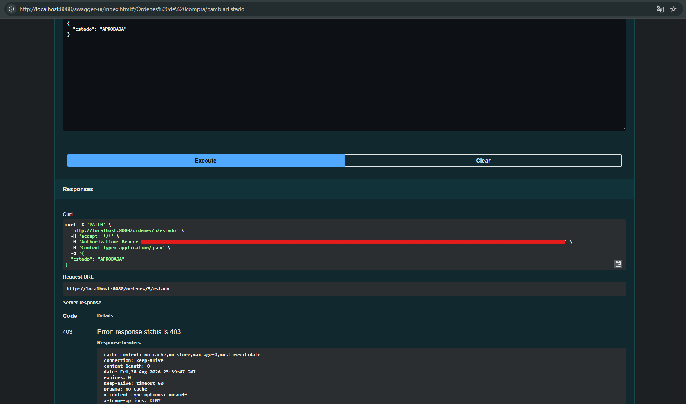 |

---

## 🐳 Docker

`docker compose up --build` construye las imágenes del backend y del
servidor MCP **desde el código fuente clonado** — al clonarse el repositorio, la
construcción ocurre localmente en cualquier máquina con Docker
instalado.

Los 3 servicios comparten la red interna `logitrack-net` y se
comunican por nombre de servicio (`backend`, `mcp-server`), sin
depender de `host.docker.internal`.

---

## 🎥 Video de sustentación

[▶️ Ver video de la sustentación](docs/video-sustentacion.mp4)

*(Enlace activo una vez se agregue el archivo `docs/video-sustentacion.mp4`
al repositorio — guardarlo con ese nombre exacto para que este enlace
funcione automáticamente.)*

---

## 🧑‍💻 Autor

Desarrollado por [**jorgegmch**](https://github.com/jorgegmch)